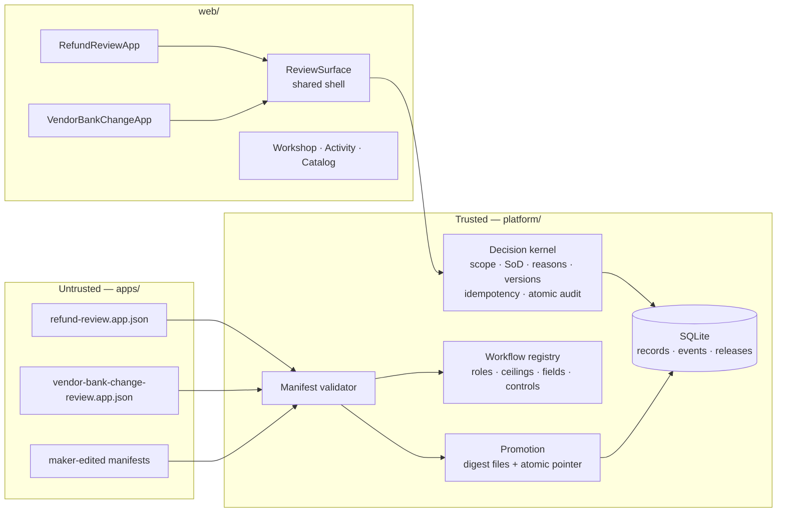
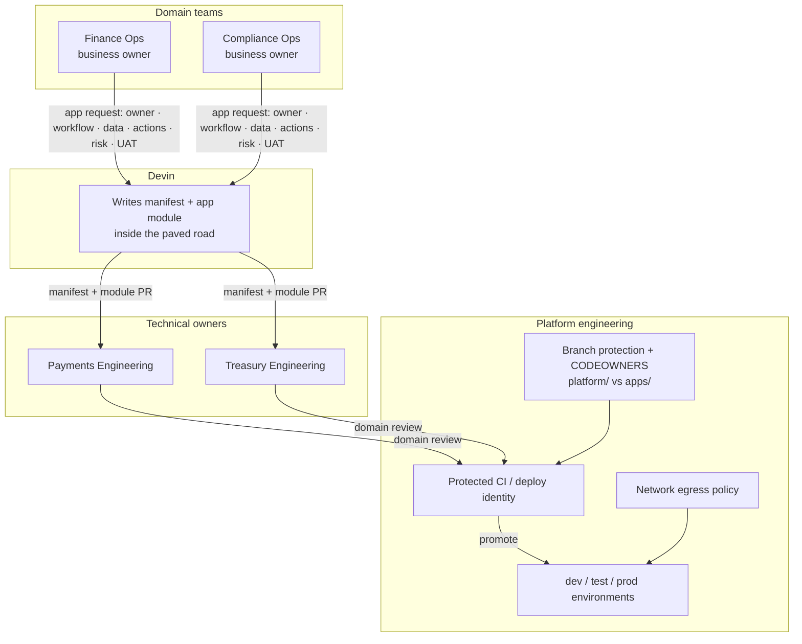

# System design — local prototype vs target design

## What runs locally today

Every request resolves the actor server-side (demo session cookie), then each
path enforces capability **and** resource scope. A record outside the actor's
scope answers 404 exactly like a missing one.

## Target design — phase-gated paved road

Domain teams own apps; platform engineering owns the foundation apps ride
on. In the target production workflow, Devin produces app definitions and
workflow-specific UI without production credentials; protected review and
deployment permissions govern changes to shared controls. These repository
protections are not configured in the prototype. Runtime manifest validation
and server-side scope checks are implemented; unrestricted repository write
access could still alter that implementation.

## Boundary honesty

- Resource scope is per-user, per-record and enforced in the kernel and the
  domain adapters; UI filters are presentation only.
- Scope is a coarse team boundary (`us-ops`, `emea-ops`, `*` oversight) —
  it is **not** row-level multi-tenancy and `*` is an oversight carve-out
  that would map to a supervised audit role in production.
- Capability narrowing remains a per-app surface control, not user data
  isolation; scope is the per-user complement.
- Demo identity is not SSO; `*` maps to "platform oversight", not a real
  break-glass design.
