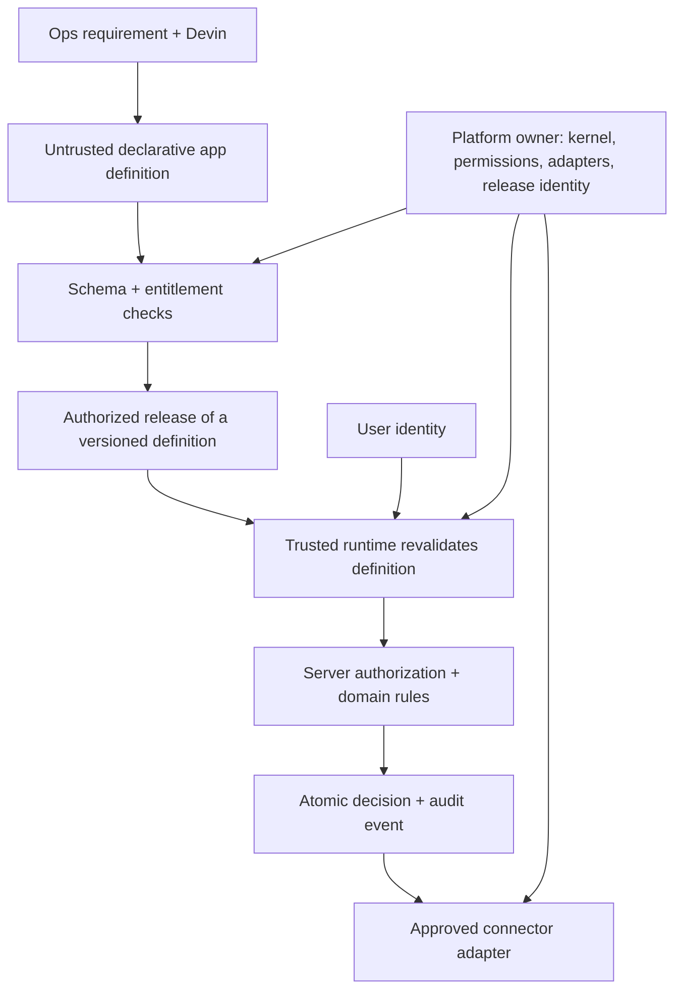

# Control Room: build the workflows, share the controls

## Recommendation to the VP of Engineering

Retain Power Apps for the three existing applications while testing a narrow, governed alternative for new tools. Use Devin to generate constrained app definitions and help engineers extend a centrally owned runtime. Do not commission thirteen independent codebases or a general-purpose Power Apps replacement.

The commercial decision is conditional: proceed beyond a pilot only if the company can identify removable license spend, reuse its existing identity/deployment services, and assign an owner whose measured support workload fits inside the savings. A pilot can establish delivery benefits before it produces any license savings.

## What problem are we solving?

The client has roughly 60 engineers, three internal applications and at least ten more planned. The known annual platform bill is $250,000. Unknowns include the number of app users, contract components, renewal terms, integration dependencies, current maintenance hours and the ten apps' requirements. Those unknowns determine the recommendation; the prototype cannot fill them in.

The shared requirement is a repeatable way to deliver tools without recreating permissions, connection handling, audit history and releases every time. The app-specific work is the workflow: which records people see, what decisions they make, and what business rules constrain those decisions. Faster screen creation helps, but it is only one component of delivery cost.

Power Apps provides visual canvas and model-driven app creation, data connections and business logic. It also offers AI-assisted creation, so AI generation alone is not the differentiator. For this client, the valuable comparison is flexibility and total ownership effort. [Microsoft overview](https://learn.microsoft.com/en-us/power-apps/powerapps-overview)

Dataverse provides role-based access and more granular data access controls; Power Platform data policies govern connector use; its application lifecycle tooling supports controlled delivery. These are configured capabilities, not automatic correctness or compliance. Their equivalents become the engineering team's responsibility if it builds. [Dataverse security](https://learn.microsoft.com/en-us/power-platform/admin/wp-security-cds), [data policies](https://learn.microsoft.com/en-us/power-platform/admin/wp-data-loss-prevention), [ALM](https://learn.microsoft.com/en-us/power-platform/alm/overview-alm)

## The proposed solution

Control Room is a trusted runtime with a deliberately small app-definition language. An Ops maker describes a workflow to Devin; Devin proposes a JSON definition using supported fields and actions. The maker previews it, automated validation rejects unsupported configurations, and an authorized platform owner releases it. A definition can narrow capabilities; it cannot grant itself new ones.

This diagram is the design. The repository's evidence and boundary documents distinguish what is implemented from production work still required. In particular, a local activation is not a cloud deployment, and a demo identity selector is not SSO.

### Three layers, three jobs

**Authoring guidance:** templates, instructions, local hooks and helpful validation shorten feedback cycles. Skipping a local hook must not grant access to anything.

**Release gates:** a centrally controlled pipeline checks definitions and trusted code changes, identifies the exact artifact being released, and requires approval appropriate to the risk. App makers cannot modify that pipeline or obtain its credentials. A workflow YAML file alone does not establish this boundary. Required checks must have a trusted source, and bypass privileges must be limited. [GitHub rulesets](https://docs.github.com/en/repositories/configuring-branches-and-merges-in-your-repository/managing-rulesets/available-rules-for-rulesets)

**Runtime enforcement:** every request is checked by the backend using a trusted identity, platform entitlements, the app's allowed actions, and record-level business rules. The strictest combination wins. An app may hide an action; it may not authorize one. Denial by default and checks on every request are established authorization principles. [OWASP authorization guidance](https://cheatsheetseries.owasp.org/cheatsheets/Authorization_Cheat_Sheet.html)

### What the platform owner must own in production

- **Identity and permissions:** existing corporate IdP, session verification, joiner/leaver handling, group mapping and record/field access. SSO establishes identity; it does not answer whether that person may approve this refund.
- **Connections:** server-side, narrowly scoped adapters to approved APIs; managed secrets, rotation, timeouts and network restrictions. A refund tool requests an approved operation, not unrestricted database access.
- **Audit:** transactionally recorded decisions, reliable export, restricted retention storage and access to evidence. A local append-only API is insufficient protection against a database administrator.
- **Releases:** separate trust for platform code and app definitions, protected pipeline and deployment identity, environment separation, version pinning, rollback and staged shared-runtime upgrades.
- **Operations:** alerts, dependency maintenance, incident response, backups and tested restoration. Shared controls reduce duplication but introduce shared failure risk.

No general claim of safe arbitrary code follows. Arbitrary JavaScript plugins, arbitrary URLs, SQL and HTML are outside the maker contract. A workflow that needs a new primitive requires an engineering change to the trusted runtime, its review and its tests. This is a deliberate limit on customization.

## Scope of the proof

Two representative workflows exercise a shared decision kernel: refund review and vendor bank-change review. The second is a proposed additional tool, not a claim that it is one of the client's known three apps. Existing KYC and feature-flag tools remain out of scope. Their data sensitivity and deployment consequences deserve separate evaluation.

These sensitive synthetic workflows stress the controls; they are not a recommendation to start the production pilot with money movement.

The useful demonstration is an attempted violation: can a maker turn off audit, request an unapproved connection, grant additional privileges or skip the friendly validator? A runtime refusal is stronger evidence than a green checklist. Follow it with a legitimate app change and a normal decision to show that the restrictions still permit useful work.

The prototype uses synthetic data. It must not execute refunds, change bank details or claim actual SSO, cloud isolation or tamper-proof auditing. See the final evidence record for observed results rather than treating this design description as proof.

## Where savings come from

There are three distinct benefits:

1. **Cash savings:** licenses and associated charges that actually disappear at a renewal or contract change. Migrating a few tools may remove none of the $250,000 bill.
2. **Engineering capacity:** fewer hours rebuilding common controls and less bespoke app maintenance. Count review, platform upgrades and incidents as well as generation time. Capacity is not payroll cash unless the company actually avoids expenditure.
3. **Operational benefit:** shorter handling times, fewer manual handoffs and fewer corrections. Compare against a well-configured Power Apps alternative, not a deliberately weak baseline; measure before valuing it.

Power Apps Premium licenses users to run unlimited custom applications. Adding ten apps therefore does not necessarily increase license cost. Do not divide $250,000 by three and multiply by thirteen. Verify the actual contract and user population. [Microsoft licensing FAQ](https://learn.microsoft.com/en-us/power-platform/admin/powerapps-flow-licensing-faq)

For a steady-state annual comparison:

**Net benefit = S - C - r × (Hbuild - Hbuy) + V**

- S: annual vendor spend actually removed relative to keeping Power Apps.
- C: additional annual hosting, monitoring, identity, connector and Devin costs, net of any current costs removed. Existing shared services are not free if extra seats/capacity are needed.
- Hbuild and Hbuy: annual engineering hours for each alternative, including app changes, platform maintenance, security, reviews and incidents.
- r: agreed fully loaded hourly cost; use the same treatment on both sides.
- V: independently measured net operational value; initially zero. Do not count the same saved hours in both H and V.

Keep one-time platform setup and migration outside the annual run-rate hours below, then add them separately to the investment case.

Illustrative assumptions, not estimates: C=$30,000/year; r=$150/hour; Hbuild-Hbuy=800 hours/year; V=$0. The annual incremental burden is $150,000. Full removal of $250,000 gives $100,000 annual benefit. Removal of $125,000 gives a $25,000 loss. No removable spend gives a $150,000 loss unless other measured benefits justify it.

If initial incremental platform work and migration cost another $80,000, the full-removal scenario leaves $20,000 in the first year only if all annual savings are realized immediately. A six-month delay before license savings reduces that year's realized savings to $125,000, producing a $105,000 first-year loss if the full annual run cost is still incurred. These deliberately simple cases expose the timing risk; use actual cost phasing in an investment decision.

At $250,000 removable spend and $30,000 additional tooling, the break-even incremental engineering allowance is about 1,467 hours/year (28/week). At $125,000 removable spend it is about 633 hours/year (12/week). Reserve headroom for incidents; breaking even in an optimistic scenario is not a sufficient reason to migrate.

The reuse hypothesis is that a later app needs much less incremental engineering than the first. It will fail if most of the ten planned apps need new connectors or custom business primitives. Inventory them before funding a platform.

## Two-week pilot and decision gates

This is a proposed follow-on experiment, not work claimed within the take-home timebox. Choose one low-risk, read-only or reversible net-new workflow. Keep the existing three apps running on Power Apps.

**Before starting:** inventory the contract, current support effort and ten-app backlog; identify app users and data classes; name a platform owner and business owner. Pick the intended reusable primitives. Agree an engineering-hours cap and success thresholds against the client's baseline rather than inventing a universal productivity target.

**During the pilot:** have an Ops maker and Devin implement two definitions using the same primitives. Record total elapsed lead time and human build/review hours. Make one policy change and verify both apps inherit it. Exercise denied access, disallowed connections, audit failure behavior, rollback and restoration. Record exceptions that require engineering. Measure end-user acceptance and maintenance effort.

**Proceed selectively if:** required controls pass adversarial review, ownership is funded, the second app uses the platform without substantial new privileged code, users accept it, and conservative total costs fit within removable spend or separately measured benefits.

**Keep buying if:** contract savings are unavailable, the backlog mostly needs bespoke integrations, there is no responsible owner, or the engineering burden exceeds the available margin. Review seat utilization and renewal terms as a lower-effort savings option. Devin can still help with surrounding integration code, tests, migration analysis and engineering maintenance without replacing the platform.

The outcome to promise is faster delivery inside explicit limits, with fewer repeated control mistakes and a tested recovery path. It is not an environment where generated apps have almost no issues.

## Evidence and authorship

Devin is the primary application builder. Codex supplied the independent scope, research, orchestration, review and written case study. The governed version reuses the earlier Devin-built Decision Desk; prior build time counts toward the same two-hour prototype budget. Current facts and sources were checked on 28 September 2026. Prototype results, cumulative time and observed usage belong in [Devin’s evidence](../EVIDENCE.md) and the [independent review](INDEPENDENT-REVIEW.md), not in assumed ROI figures.
