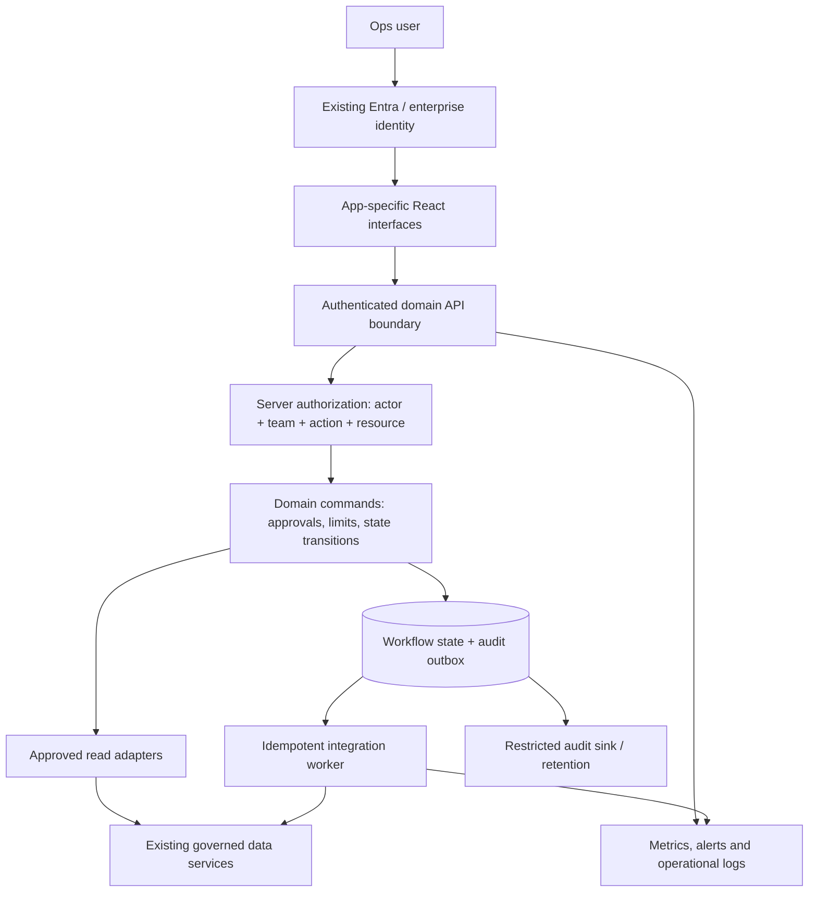
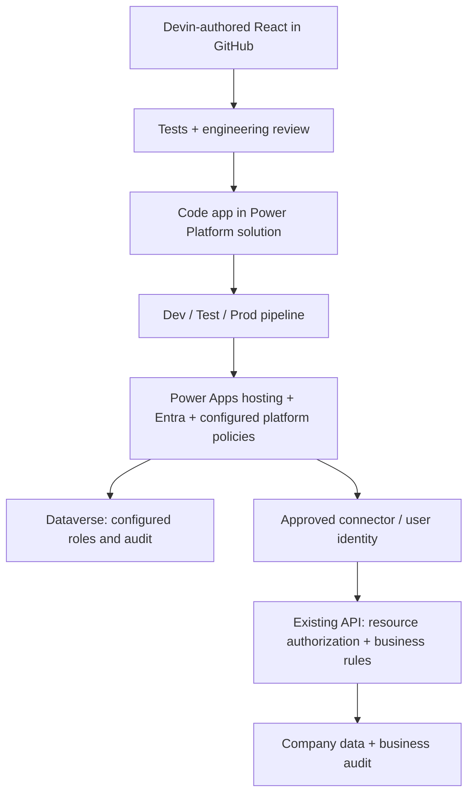

# Paved road: system design and ownership

Target architecture, not a claim of deployed infrastructure. Local implementation evidence belongs in the Devin PR and evidence ledger. Proposed team labels below are role assignments to confirm, not actual client teams.

## 1. Runtime: separate flexible app code from authority

The frontends have no privileged database credentials. Platform Engineering owns API authentication, common policy plumbing, deployment and observability. Domain Engineering owns business rules and integrations. Ops owns the workflow, acceptance criteria and day-to-day use. Production authority never comes from an app-supplied role, team ID or hidden button.

Authorize list, detail, mutation, audit, export and attachments independently. Apply row scope before pagination/counts and field filtering before serialization. Reject or conceal guessed out-of-scope IDs consistently. Audit access needs its own permission: an audit trail can expose the same sensitive data as a business record.

For a refund command: validate the authenticated actor and scope; check action permission, no self-approval, amount and balance, permitted state, mandatory reason and expected record version; atomically persist the state transition and audit event/outbox. Use actor/resource/operation-scoped idempotency, reject reuse with a different payload, and do not disclose another actor's cached result.

Real financial execution is asynchronous and separate from approval. Commit an outbox event, call the payment service with an idempotency key, and record execution status. Reconcile uncertain results before retrying. A database transaction does not make an external API call atomic. This worker is production design, not a requirement to move real money in the demo.

## 2. Delivery: the agent proposes; protected systems deploy

```mermaid
flowchart LR
  O[Ops brief + acceptance criteria] --> D[Devin branch / synthetic data]
  D --> PR[Pull request + test evidence]
  PR --> CI[Required CI: contracts, authorization, dependencies]
  CI --> REV[App owner UAT + engineering review]
  REV --> DEV[Deploy immutable artifact to test]
  DEV --> GATE[Production approval]
  GATE --> PROD[Deployment identity promotes same artifact]
  PROD --> MON[Monitor, rollback, incident ownership]
```

Production credentials are unavailable to Devin and makers. Protect platform code, workflows, ownership configuration and migrations with actual repository rules and required reviewers. A CODEOWNERS file without enforced rules is documentation. In production, custom server extensions should run with constrained credentials and access approved APIs; importing a helper or passing a lint rule is not isolation.

Use one monorepo initially, app-specific directories and versioned shared contracts. One repo does not require one deployment. Keep independent frontend artifacts and rollback where justified; use a shared backend initially to avoid thirteen services. Expand isolation only where risk or workload demands it. Shared policy failures remain a portfolio-wide risk: stage shared changes, run all consumer tests, canary release, and preserve compatible API versions.

Back up state and configuration, test restoration, define RPO/RTO with business owners, and test migration compatibility before rollout. Rollback of code does not necessarily roll back data migrations.

## 3. Portfolio and ownership

| Portfolio | Proposed Ops owner | Technical owner | Shared production responsibility |
|---|---|---|---|
| Refunds, reconciliation, chargeback triage, card fraud rules, escrow release (5) | Finance / Disputes / Risk Ops; explicit owner per app | Payments Engineering | Platform Engineering |
| Vendor bank changes, liquidity monitor, vendor onboarding (3) | Finance / Treasury / Procurement Ops; explicit owner per app | Treasury Engineering | Platform Engineering |
| KYC review, sanction-hit review, access review (3) | Compliance / Security Ops; explicit owner per app | Identity Engineering | Platform Engineering |
| Pricing exceptions (1) | Commercial Ops | Billing Engineering | Platform Engineering |
| Feature-flag admin (1) | Product Ops | Platform Engineering | Platform Engineering |

Only KYC, refunds and flags are specified by the case. Other names are illustrative discovery candidates, not confirmed demand. Catalog owner labels are accountability metadata, not IAM assignments or enforced GitHub team permissions. A manager overseeing four or five apps is a portfolio arrangement, not a validated staffing ratio. Require a named individual and backup for each app before production, even when a team owns several. Classify risk by the actual capability: a production flag write may be high impact even if a read-only flag inventory is not.

Platform Engineering owns runtime upgrades, delivery services, incident coordination and recovery. Domain engineers own authorization semantics, connector behavior, data contracts and privileged changes. Security approves the threat model and access/retention standards. Ops can maintain content, workflow specs, UAT and routine requests; changes that affect data access, financial policy or production systems retain engineering review. Lower-risk release delegation is earned through observed performance and cannot change production privilege boundaries.

## 4. The control plane stays small

Start with a registry: app ID, business owner, technical owner, risk, lifecycle, data classification, allowed integrations, deployed version, runbook and evidence links. Show real metadata, not pretend health metrics. Use existing GitHub/cloud/identity/logging administration rather than build replicas.

This catalog is easy. Enforcing safe credentials, policy, releases, retention and recovery is the substantial part. Inventory and policy enforcement must not be confused. Add a kill switch only with a defined enforcement point and tests; a red badge in a catalog is not a disabled app.

## 5. Audit design

Separate identity sign-ins, platform/configuration changes, data reads/exports, and business decisions. Correlate actor, resource, operation, timestamp, reason, outcome, app/release, request and policy version. Minimize sensitive values; preserve required decision evidence without placing raw PII in routine logs.

Successful sensitive writes must atomically create their decision evidence; audit persistence failure should prevent the state transition. Record denied attempts in security telemetry without granting broad access to business audit data. Export events to a restricted sink with retention and deletion policy independently administered. An application-level append-only table is not protection against a database administrator.

## 6. Managed-platform fallback

Microsoft hosts the frontend and provides supported platform governance. The team still owns its custom code, dependencies, permissions configuration, business policy, external integrations and UAT. Dataverse protection applies where data and access actually pass through Dataverse. Existing company APIs remain authoritative for their data. Verify each connector's execution identity and avoid excessive shared privileges.

UI/domain contracts may be reusable, but fallback migration is not a free hosting switch. Replace data adapters, initialize the SDK, configure connections and sharing, test identity context, audit and solution deployment. Product limitations and tenant configuration must be checked in the real pilot.

## 7. Demo versus production

The local prototype uses React/Express/SQLite and synthetic identities/data. Two custom app modules, team-scope enforcement and portfolio metadata are implemented and reviewed; see BUILD-REVIEW.md for exact revisions, failures and final checks. No real Entra integration, protected deployment, independent audit sink, financial execution worker or Microsoft environment has been demonstrated. Independently deployable production apps are the target; a local shared host is sufficient to test reuse and API controls.
